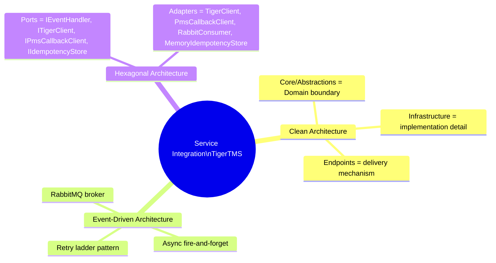
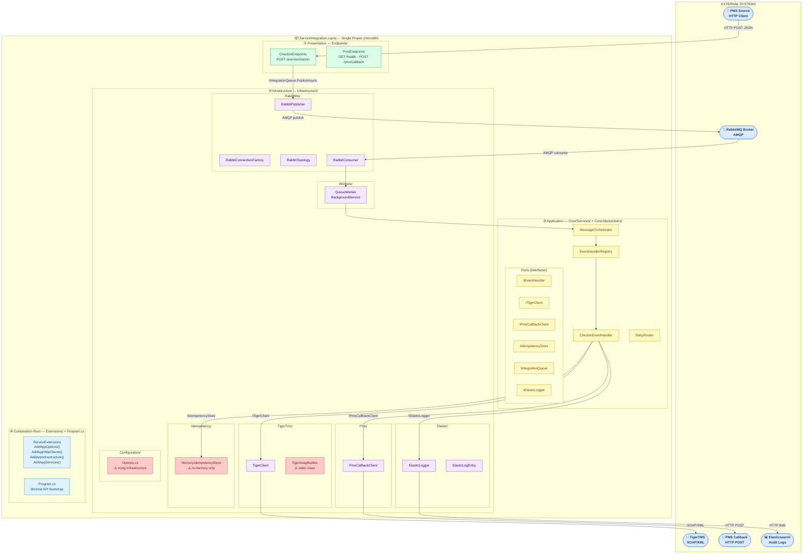
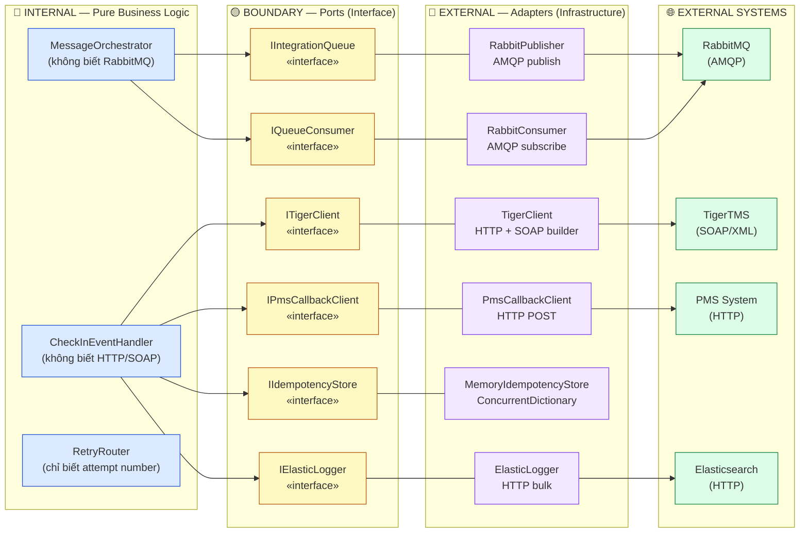
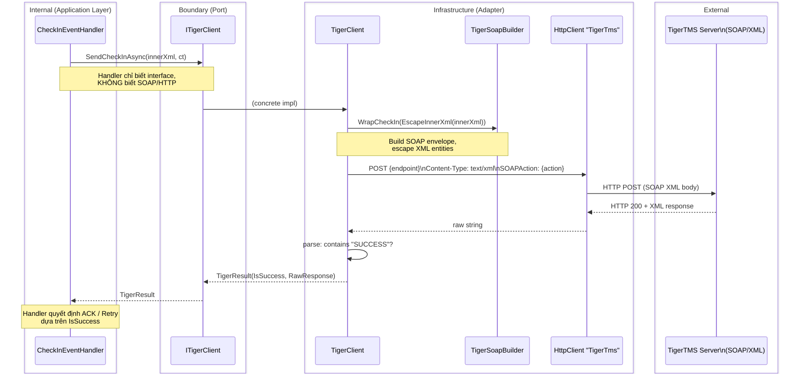
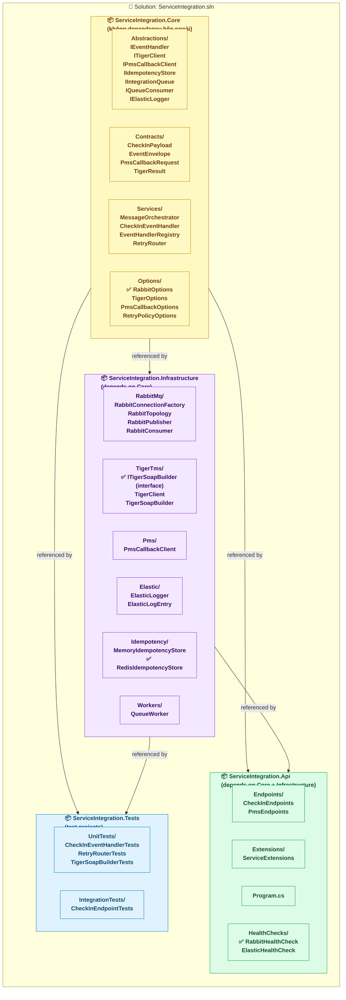
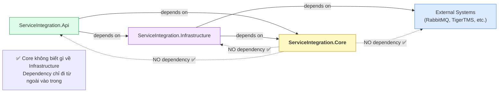
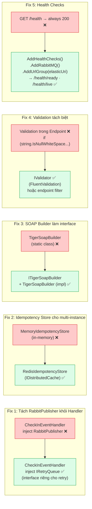
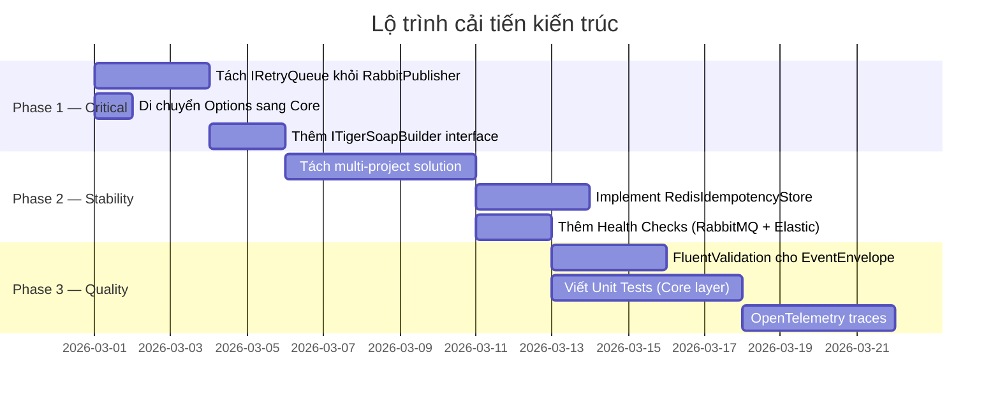

# Phân Tích Kiến Trúc — Service Integration TigerTMS

> **Mục tiêu tài liệu:** Phân tích mẫu kiến trúc đang sử dụng, đánh giá điểm mạnh/yếu,
> đề xuất cải tiến, và cung cấp sơ đồ kiến trúc phân tầng chuẩn cho dự án .NET Minimal API.

---

## 1. Nhận diện mẫu kiến trúc (Architectural Pattern)

Dự án hiện tại kết hợp **3 mẫu kiến trúc chính**:



| Mẫu kiến trúc | Biểu hiện trong code | Mục đích |
|---|---|---|
| **Clean Architecture** | `Core/Abstractions/` chứa interfaces; `Infrastructure/` chứa implementation | Tách business rule khỏi detail kỹ thuật |
| **Hexagonal (Ports & Adapters)** | `IEventHandler`, `ITigerClient`, `IPmsCallbackClient` = Ports; các class Infrastructure = Adapters | Cho phép thay thế implementation không ảnh hưởng nghiệp vụ |
| **Event-Driven + CQRS-lite** | `EventHandlerRegistry` + `MessageOrchestrator` + `IEventHandler` | Mỗi loại event có handler riêng, dễ mở rộng |
| **Outbox-style Retry** | Retry queues `10s → 1m → 5m → 30m → Dead` | Đảm bảo at-least-once delivery, chịu lỗi tạm thời |
| **Idempotency Pattern** | `IIdempotencyStore.SeenRecently()` + `MarkSeen()` | Tránh xử lý trùng khi retry |

---

## 2. Sơ đồ kiến trúc phân tầng hiện tại (As-Is)



---

## 3. Phân tích Separation of Concerns

### 3.1 Ranh giới tích hợp bên ngoài (External Integration Boundary)



### 3.2 TigerTMS SOAP Integration Boundary (Chi tiết)



---

## 4. Đánh giá điểm mạnh / điểm yếu

### ✅ Điểm mạnh

| Điểm mạnh | Lý do |
|---|---|
| **Interface-first (Ports)** | Toàn bộ external dependency được abstract qua interface → dễ test, dễ thay thế |
| **Async fire-and-forget** | Endpoint trả về ngay lập tức, processing hoàn toàn tách biệt → high throughput |
| **Retry ladder có cấu trúc** | `10s → 1m → 5m → 30m → Dead` với `x-attempt` header → resilient, không mất message |
| **Idempotency built-in** | Kiểm tra trước mọi I/O, mark sau khi toàn bộ thành công → safe at-least-once |
| **Structured audit logging** | `ElasticLogEntry` + `TimedAsync` → latency tracking + full audit trail |
| **Mock mode** | `TigerOptions.Enabled=false` → test không cần external system |
| **Graceful startup** | RabbitMQ lỗi không crash service → endpoint vẫn hoạt động |

### ⚠️ Điểm yếu & Rủi ro

| Vấn đề | Mức độ | Mô tả |
|---|---|---|
| **Monolithic single project** | 🔴 Cao | Tất cả layers trong 1 `.csproj` → không enforce dependency rule ở build time |
| **`RabbitPublisher` leak vào Application** | 🔴 Cao | `CheckInEventHandler` inject trực tiếp `RabbitPublisher` (concrete) thay vì `IIntegrationQueue` cho retry |
| **`MemoryIdempotencyStore`** | 🔴 Cao | Chỉ hoạt động 1 instance, mất data khi restart → sai với multi-instance deployment |
| **`TigerSoapBuilder` static class** | 🟡 Trung bình | Static không mockable → khó test `TigerClient` đơn vị |
| **Options trong Infrastructure** | 🟡 Trung bình | `Options.cs` đặt trong `Infrastructure/Configuration/` → Core không tham chiếu được trực tiếp |
| **Không có validation middleware** | 🟡 Trung bình | Validation logic viết thẳng trong endpoint handler |
| **Không có health check có cấu trúc** | 🟡 Trung bình | Chỉ có `GET /health` tĩnh, không kiểm tra Rabbit/Elastic connectivity |
| **Không có OpenTelemetry/Metrics** | 🟢 Thấp | Thiếu traces phân tán để debug khi tích hợp nhiều service |
| **SOAP parsing bằng string.Contains** | 🟡 Trung bình | `raw.Contains("SUCCESS")` — brittle, không parse XML structure đúng nghĩa |

---

## 5. Kiến trúc đề xuất cải tiến (To-Be)

### 5.1 Phân tách dự án (Multi-project solution)



### 5.2 Dependency Rule (hướng phụ thuộc)



### 5.3 Cải tiến cụ thể theo từng vấn đề



---

## 6. Cấu trúc folder đề xuất (Improved Structure)

```
ServiceIntegration.sln
│
├── src/
│   ├── ServiceIntegration.Core/               ← Pure domain, zero external dependency
│   │   ├── Abstractions/
│   │   │   ├── IEventHandler.cs
│   │   │   ├── ITigerClient.cs
│   │   │   ├── IPmsCallbackClient.cs
│   │   │   ├── IIdempotencyStore.cs
│   │   │   ├── IIntegrationQueue.cs
│   │   │   ├── IRetryQueue.cs                 ← ✅ tách khỏi IIntegrationQueue
│   │   │   ├── IQueueConsumer.cs
│   │   │   ├── ITigerSoapBuilder.cs           ← ✅ interface cho SOAP builder
│   │   │   └── IElasticLogger.cs
│   │   ├── Contracts/
│   │   │   ├── CheckInPayload.cs
│   │   │   ├── EventEnvelope.cs
│   │   │   ├── PmsCallbackRequest.cs
│   │   │   └── TigerResult.cs
│   │   ├── Options/                           ← ✅ chuyển từ Infrastructure sang Core
│   │   │   ├── RabbitOptions.cs
│   │   │   ├── TigerOptions.cs
│   │   │   ├── PmsCallbackOptions.cs
│   │   │   ├── ElasticOptions.cs
│   │   │   └── RetryPolicyOptions.cs
│   │   └── Services/
│   │       ├── MessageOrchestrator.cs
│   │       ├── EventHandlerRegistry.cs
│   │       ├── CheckInEventHandler.cs
│   │       └── RetryRouter.cs
│   │
│   ├── ServiceIntegration.Infrastructure/     ← Adapters, I/O, external systems
│   │   ├── RabbitMq/
│   │   │   ├── RabbitConnectionFactory.cs
│   │   │   ├── RabbitTopology.cs
│   │   │   ├── RabbitPublisher.cs             ← implements IIntegrationQueue + IRetryQueue
│   │   │   └── RabbitConsumer.cs
│   │   ├── TigerTms/
│   │   │   ├── TigerClient.cs                 ← implements ITigerClient
│   │   │   └── TigerSoapBuilder.cs            ← implements ITigerSoapBuilder
│   │   ├── Pms/
│   │   │   └── PmsCallbackClient.cs           ← implements IPmsCallbackClient
│   │   ├── Elastic/
│   │   │   ├── ElasticLogger.cs               ← implements IElasticLogger
│   │   │   └── ElasticLogEntry.cs
│   │   ├── Idempotency/
│   │   │   ├── MemoryIdempotencyStore.cs      ← single-instance dev/test
│   │   │   └── RedisIdempotencyStore.cs       ← ✅ production multi-instance
│   │   └── Workers/
│   │       └── QueueWorker.cs
│   │
│   └── ServiceIntegration.Api/                ← Composition root + HTTP surface
│       ├── Endpoints/
│       │   ├── CheckInEndpoints.cs
│       │   └── PmsEndpoints.cs
│       ├── Extensions/
│       │   └── ServiceExtensions.cs
│       ├── HealthChecks/                      ← ✅ mới
│       │   ├── RabbitHealthCheck.cs
│       │   └── ElasticHealthCheck.cs
│       ├── Filters/                           ← ✅ mới — validation endpoint filter
│       │   └── EventEnvelopeValidationFilter.cs
│       └── Program.cs
│
└── tests/
    ├── ServiceIntegration.UnitTests/
    │   ├── CheckInEventHandlerTests.cs
    │   ├── RetryRouterTests.cs
    │   └── TigerSoapBuilderTests.cs
    └── ServiceIntegration.IntegrationTests/
        └── CheckInEndpointTests.cs
```

---

## 7. Lộ trình cải tiến (Improvement Roadmap)



### Mức ưu tiên

| # | Cải tiến | Ưu tiên | Lý do |
|---|---|---|---|
| 1 | Tách `IRetryQueue` — đưa reference từ concrete `RabbitPublisher` về interface | 🔴 Ngay | Vi phạm Dependency Inversion trực tiếp |
| 2 | `RedisIdempotencyStore` thay thế `MemoryIdempotencyStore` | 🔴 Ngay | Rủi ro duplicate khi deploy multi-instance hoặc restart |
| 3 | `ITigerSoapBuilder` làm interface | 🟡 Soon | Mở khóa khả năng unit test `TigerClient` không cần HTTP |
| 4 | Di chuyển `Options.cs` vào Core | 🟡 Soon | Core hiện phụ thuộc ngầm vào namespace Infrastructure |
| 5 | Tách multi-project | 🟡 Soon | Enforce dependency rule ở compiler level |
| 6 | Health checks đầy đủ | 🟢 Later | Cần cho monitoring production (k8s readiness/liveness) |
| 7 | Unit tests cho Core layer | 🟢 Later | Core layer hiện 0% test coverage |
| 8 | OpenTelemetry | 🟢 Later | Distributed tracing khi scale |

---

*Tài liệu được phân tích dựa trên source code thực tế — cập nhật khi kiến trúc thay đổi.*
