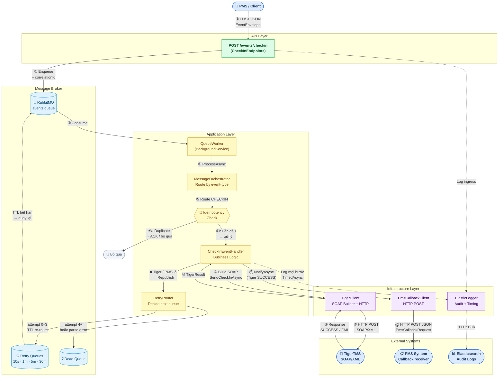
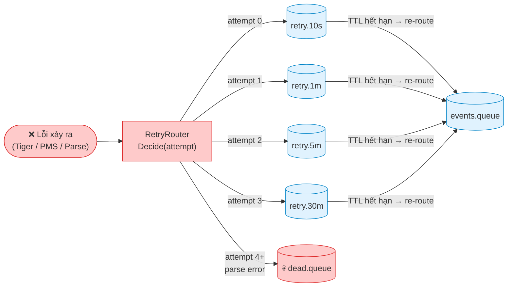
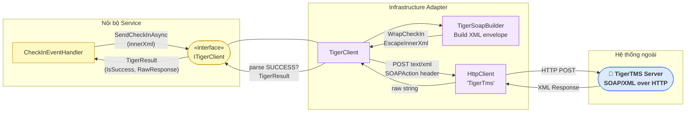

# Sơ Đồ Kiến Trúc Khối — Service Integration TigerTMS

> Sơ đồ mức cao (high-level) thể hiện hai luồng chính của hệ thống tích hợp.

---

## Sơ đồ tổng quan

---

## Giải thích hai luồng chính

### Luồng 1 — Check-in: PMS gửi sự kiện

| Bước | Thành phần | Mô tả |
|:---:|---|---|
| ① | **PMS → CheckInEndpoints** | PMS gửi HTTP POST kèm `EventEnvelope` (JSON) |
| ② | **Endpoint → RabbitMQ** | Endpoint validate input tối thiểu, gán `correlationId`, đẩy vào `events.queue` → trả `200 QUEUED` ngay lập tức |
| ③–④ | **RabbitMQ → QueueWorker** | `QueueWorker` (BackgroundService) liên tục lắng nghe và chuyển message xuống `MessageOrchestrator` |
| ⑤ | **Orchestrator route** | Đọc header `x-event-type`, tra cứu handler phù hợp trong `EventHandlerRegistry` |
| ⑥ | **Idempotency check** | Kiểm tra `(hotelId, eventId)` đã xử lý chưa — nếu trùng thì ACK bỏ qua ngay |
| ⑦–⑨ | **Handler → TigerClient → TigerTMS** | Build SOAP XML, gọi HTTP POST đến TigerTMS, nhận kết quả |
| ⑩ | **TigerResult** | `IsSuccess = true/false` quyết định tiếp tục hay retry |

### Luồng 2 — Callback: thông báo kết quả về PMS

| Bước | Thành phần | Mô tả |
|:---:|---|---|
| ⑪ | **Handler → PmsCallbackClient** | Sau khi Tiger trả SUCCESS, gọi `NotifyAsync` |
| ⑫ | **PmsCallbackClient → PMS** | HTTP POST JSON mang `TigerStatus`, `EventId`, `CorrelationId` về hệ thống PMS gốc |

### Luồng 3 — Retry / Dead-letter

> **Nguyên tắc:** Message **không bao giờ bị mất**. Khi lỗi, message được republish vào queue retry với TTL tăng dần. Sau 4 lần thất bại (hoặc lỗi không thể thử lại như parse error), message chuyển vào `dead.queue` để xem xét thủ công.

---

## Ranh giới tích hợp TigerTMS SOAP

> **Điểm quan trọng:** `CheckInEventHandler` **chỉ biết `ITigerClient`** — không biết gì về SOAP, XML, hay HTTP.
> Toàn bộ chi tiết giao tiếp được đóng gói trong `TigerClient` (adapter) và `TigerSoapBuilder`.
> Đây là ranh giới tách biệt rõ ràng giữa **business logic** và **integration detail**.

---

*Sơ đồ được tổng hợp từ source code thực tế của dự án.*
