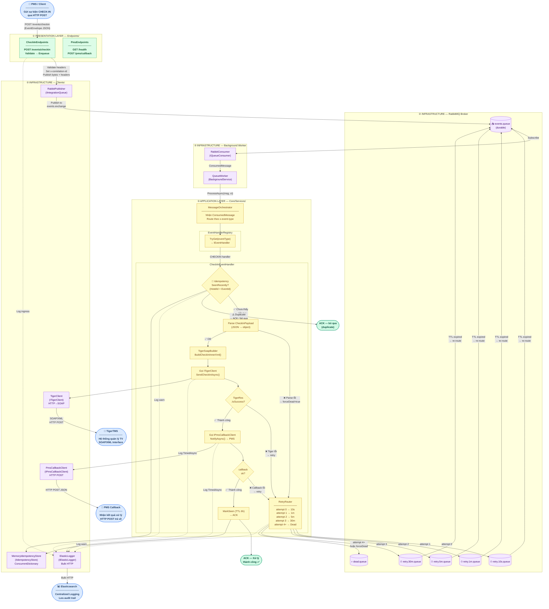
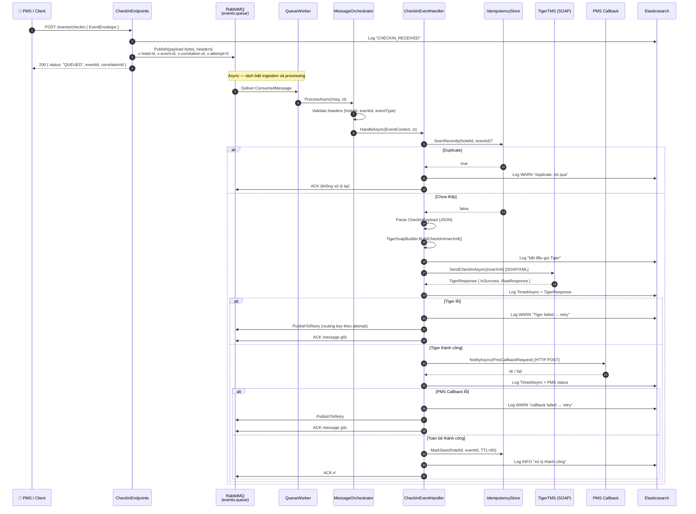
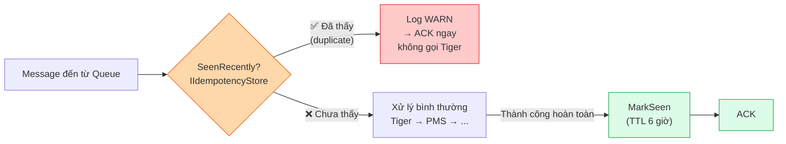

# Architecture Diagram — Service Integration TigerTMS

> **Mô tả:** Sơ đồ kiến trúc tổng thể của service tích hợp giữa PMS và hệ thống TigerTMS,
> thể hiện các tầng (layer), luồng xử lý request, và vị trí kiểm tra Idempotency.

---

## 1. Sơ đồ kiến trúc phân tầng (Clean Architecture)

---

## 2. Giải thích các tầng

### ① Presentation Layer — `Endpoints/`

| Class | Route | Vai trò |
|---|---|---|
| `CheckInEndpoints` | `POST /events/checkin` | Nhận sự kiện từ PMS, gán `correlationId`, publish vào RabbitMQ qua `IIntegrationQueue` |
| `PmsEndpoints` | `GET /health`, `POST /pms/callback` | Health check và nhận callback demo từ PMS |

> **Nguyên tắc:** Endpoint **không xử lý logic nghiệp vụ**. Chỉ validate input cơ bản (hotelId, eventId) rồi đưa message vào queue ngay lập tức — trả về `202 QUEUED` cho client. Đây là mẫu **async fire-and-forget** để tách biệt ingestion khỏi processing.

---

### ② Infrastructure Layer — `Infrastructure/`

| Thành phần | Class | Vai trò |
|---|---|---|
| **Queue Broker** | `RabbitPublisher`, `RabbitConsumer`, `RabbitTopology` | Quản lý kết nối, khai báo exchange/queue/binding, publish và subscribe message |
| **Background Worker** | `QueueWorker` *(BackgroundService)* | Vòng lặp liên tục consume message từ `IQueueConsumer`, chuyển tiếp xuống `MessageOrchestrator` |
| **TigerTMS Client** | `TigerClient` + `TigerSoapBuilder` | Xây dựng SOAP/XML và gọi HTTP POST đến TigerTMS endpoint |
| **PMS Callback Client** | `PmsCallbackClient` | Gọi HTTP POST trả kết quả về PMS gốc |
| **Logging** | `ElasticLogger` | Ghi audit log có cấu trúc (JSON) lên Elasticsearch, hỗ trợ `TimedAsync` để đo latency |
| **Idempotency Store** | `MemoryIdempotencyStore` | Lưu `(hotelId, eventId)` đã xử lý trong `ConcurrentDictionary` với TTL 6 giờ |

---

### ③ Application Layer — `Core/Services/`

| Class | Vai trò |
|---|---|
| `MessageOrchestrator` | Đọc header `x-event-type`, tra cứu handler trong `EventHandlerRegistry`, uỷ quyền xử lý |
| `EventHandlerRegistry` | Registry pattern — ánh xạ `eventType → IEventHandler` |
| `CheckInEventHandler` | Toàn bộ nghiệp vụ xử lý CHECKIN: idempotency → parse → build SOAP → gọi Tiger → gọi PMS callback → ACK |
| `RetryRouter` | Quyết định queue retry dựa theo số lần thử: `10s → 1m → 5m → 30m → Dead` |

---

## 3. Luồng xử lý chi tiết (Request Flow)

---

## 4. Vị trí xử lý Idempotency

| Bước | Nơi thực hiện | Chi tiết |
|---|---|---|
| **Kiểm tra trùng** | `CheckInEventHandler.HandleAsync()` — đầu hàm | `_idempo.SeenRecently(hotelId, eventId)` trước mọi tác vụ I/O |
| **Lưu đã xử lý** | `CheckInEventHandler.HandleAsync()` — cuối hàm (happy path) | `_idempo.MarkSeen(hotelId, eventId, TimeSpan.FromHours(6))` chỉ sau khi Tiger **và** PMS callback đều thành công |
| **Storage** | `MemoryIdempotencyStore` | `ConcurrentDictionary<string, DateTime>` — in-process, reset khi restart |

> ⚠️ **Lưu ý vận hành:** `MemoryIdempotencyStore` chỉ hoạt động trong 1 process. Nếu triển khai multi-instance, cần thay bằng Redis-backed store để idempotency hoạt động chính xác.

---

## 5. Cấu trúc Dependency Injection (ServiceExtensions)

```mermaid
graph LR
    subgraph AddAppOptions
        O1["RabbitOptions\n← appsettings.RabbitMq"]
        O2["TigerOptions\n← appsettings.TigerTms"]
        O3["PmsCallbackOptions\n← appsettings.PmsCallback"]
        O4["RetryPolicyOptions\n← appsettings.RetryPolicy"]
    end

    subgraph AddAppHttpClients
        H1["HttpClient: TigerTms\n(timeout từ TigerOptions)"]
        H2["HttpClient: PmsCallback\n(timeout từ PmsCallbackOptions)"]
        H3["HttpClient: Elastic\n(timeout 5s cứng)"]
    end

    subgraph AddAppInfrastructure
        I1["RabbitConnectionFactory\nSingleton"]
        I2["RabbitTopology  Singleton"]
        I3["RabbitPublisher → IIntegrationQueue\nSingleton"]
        I4["RabbitConsumer → IQueueConsumer\nSingleton"]
        I5["ElasticLogger → IElasticLogger\nSingleton"]
        I6["TigerClient → ITigerClient\nSingleton"]
        I7["PmsCallbackClient → IPmsCallbackClient\nSingleton"]
        I8["MemoryIdempotencyStore → IIdempotencyStore\nSingleton"]
    end

    subgraph AddAppServices
        S1["RetryRouter  Singleton"]
        S2["CheckInEventHandler → IEventHandler\nSingleton"]
        S3["EventHandlerRegistry  Singleton"]
        S4["MessageOrchestrator  Singleton"]
        S5["QueueWorker\nHostedService"]
    end

    AddAppOptions --> AddAppInfrastructure
    AddAppHttpClients --> AddAppInfrastructure
    AddAppInfrastructure --> AddAppServices
```

---

*Tài liệu được tự động tổng hợp từ source code — cập nhật khi có thay đổi kiến trúc.*
