# ServiceIntegration – Cấu trúc kiến trúc

> Cập nhật: 2026-02-27  
> Dự án: EAS-35101 Tích hợp TigerTMS Interface

---

## Sơ đồ kiến trúc (Mermaid)

```mermaid
flowchart TD
    ROOT["📦 ServiceIntegration
    ─────────────────────────────
    Entry point: Program.cs
    Khởi tạo host, DI, Middleware, Swagger"]

    ROOT --> EXT
    ROOT --> EP
    ROOT --> CORE
    ROOT --> INFRA

    EXT["📂 Extensions/
    ─────────────────────────────
    Đăng ký Dependency Injection
    cho toàn bộ ứng dụng"]
    EXT --> E1["ServiceExtensions.cs
    ──────────────────
    AddAppOptions()
      → RabbitOptions, TigerOptions,
        PmsCallbackOptions, RetryPolicyOptions
    AddAppHttpClients()
      → HttpClient: TigerTms, PmsCallback, Elastic
    AddAppInfrastructure()
      → RabbitMQ, TigerClient,
        PmsCallbackClient, ElasticLogger, IdempotencyStore
    AddAppServices()
      → RetryRouter, CheckInEventHandler,
        EventHandlerRegistry, MessageOrchestrator,
        QueueWorker (HostedService)"]

    EP["📂 Endpoints/
    ─────────────────────────────
    Minimal API – nhận/trả HTTP request
    Không chứa business logic"]
    EP --> EP1["CheckInEndpoints.cs
    ──────────────────
    POST /events/checkin
      → Nhận event từ PMS
      → Enqueue vào RabbitMQ
      → Ghi log vào Elastic"]
    EP --> EP2["PmsEndpoints.cs
    ──────────────────
    GET  /health → Health check
    POST /pms/callback → Nhận callback TigerTMS (demo)"]

    CORE["📂 Core/
    ─────────────────────────────
    Business logic thuần – không phụ thuộc
    vào infrastructure cụ thể"]
    CORE --> ABS["📂 Abstractions/
    Giao diện + contract dùng chung
    IEventHandler, IIntegrationQueue
    IQueueConsumer, ITigerClient
    IPmsCallbackClient, IElasticLogger
    IIdempotencyStore, MessageHeaders"]
    CORE --> CNT["📂 Contracts/
    DTO dùng trong luồng xử lý
    EventEnvelope, CheckInPayload"]
    CORE --> SVC["📂 Services/
    Xử lý business logic chính
    CheckInEventHandler   – xử lý sự kiện CHECKIN
    EventHandlerRegistry  – tra cứu handler theo event type
    MessageOrchestrator   – điều phối message từ queue
    RetryRouter           – định tuyến retry / DLQ"]

    INFRA["📂 Infrastructure/
    ─────────────────────────────
    Implementation cụ thể của từng
    thành phần kỹ thuật (adapter layer)"]
    INFRA --> CFG["📂 Configuration/
    Options.cs → RabbitOptions, TigerOptions,
    PmsCallbackOptions, RetryPolicyOptions"]
    INFRA --> ELC["📂 Elastic/
    ElasticLogger.cs
    → Ghi structured log lên Elasticsearch
      qua HTTP (chủ động, không tự động)"]
    INFRA --> IDP["📂 Idempotency/
    MemoryIdempotencyStore.cs
    → Kiểm tra trùng lặp event (in-memory)"]
    INFRA --> PMS["📂 Pms/
    PmsCallbackClient.cs
    → Gửi HTTP callback về PMS sau khi xử lý xong"]
    INFRA --> RMQ["📂 RabbitMq/
    RabbitConnectionFactory.cs  – quản lý connection
    RabbitTopology.cs           – khai báo exchange/queue
    RabbitPublisher.cs          – publish message
    RabbitConsumer.cs           – consume message"]
    INFRA --> TGR["📂 TigerTms/
    TigerClient.cs       – gọi API TigerTMS
    TigerSoapBuilder.cs  – tạo SOAP XML request"]
    INFRA --> WRK["📂 Workers/
    QueueWorker.cs
    → BackgroundService – liên tục đọc queue,
      chuyển cho MessageOrchestrator xử lý"]

    classDef group fill:#1e3a5f,stroke:#4a90d9,color:#e8f4fd
    classDef file  fill:#0d2137,stroke:#2d6a9f,color:#cde8ff
    classDef root  fill:#14213d,stroke:#fca311,color:#ffd166

    class ROOT root
    class EXT,EP,CORE,INFRA group
    class E1,EP1,EP2,ABS,CNT,SVC,CFG,ELC,IDP,PMS,RMQ,TGR,WRK file
```



---

## Cây thư mục chi tiết

```
src/ServiceIntegration/
│
├── Program.cs                          # Entry point – khởi tạo host, DI, Swagger, RabbitTopology
│
├── 📂 Extensions/                      # Đăng ký Dependency Injection cho toàn bộ ứng dụng
│   └── ServiceExtensions.cs
│       ├── AddAppOptions()             → Bind config: RabbitOptions, TigerOptions,
│       │                                 PmsCallbackOptions, RetryPolicyOptions
│       ├── AddAppHttpClients()         → Đăng ký HttpClient: TigerTms, PmsCallback, Elastic
│       ├── AddAppInfrastructure()      → Đăng ký: RabbitMQ, TigerClient, PmsCallbackClient,
│       │                                 ElasticLogger, IdempotencyStore
│       └── AddAppServices()           → Đăng ký: RetryRouter, CheckInEventHandler,
│                                         EventHandlerRegistry, MessageOrchestrator,
│                                         QueueWorker (HostedService)
│
├── 📂 Endpoints/                       # Minimal API – tiếp nhận HTTP request (không chứa business logic)
│   ├── CheckInEndpoints.cs
│   │   └── POST /events/checkin        → Nhận event CHECKIN từ PMS, enqueue RabbitMQ, ghi log Elastic
│   └── PmsEndpoints.cs
│       ├── GET  /health                → Health check
│       └── POST /pms/callback          → Nhận callback từ TigerTMS (demo/testing)
│
├── 📂 Core/                            # Business logic thuần – không phụ thuộc infrastructure
│   ├── 📂 Abstractions/               → Interface & contract dùng chung giữa các layer
│   │   ├── IEventHandler.cs            → Xử lý một loại event
│   │   ├── IIntegrationQueue.cs        → Publish message vào queue
│   │   ├── IQueueConsumer.cs           → Consume message từ queue
│   │   ├── ITigerClient.cs             → Giao tiếp với TigerTMS
│   │   ├── IPmsCallbackClient.cs       → Gửi callback về PMS
│   │   ├── IElasticLogger.cs           → Ghi log lên Elasticsearch
│   │   ├── IIdempotencyStore.cs        → Kiểm tra trùng lặp event
│   │   ├── ElasticLogEntry.cs          → Builder để tạo log entry có cấu trúc
│   │   └── MessageHeaders.cs          → Header metadata của message
│   ├── 📂 Contracts/                  → DTO dùng trong luồng xử lý
│   │   ├── EventEnvelope.cs            → Bao bì chứa event gửi vào hệ thống
│   │   └── CheckInPayload.cs           → Dữ liệu nghiệp vụ sự kiện CHECKIN
│   └── 📂 Services/                   → Xử lý business logic chính
│       ├── CheckInEventHandler.cs      → Xử lý CHECKIN: gọi TigerTMS, callback PMS, ghi log
│       ├── EventHandlerRegistry.cs     → Tra cứu IEventHandler phù hợp theo event type
│       ├── MessageOrchestrator.cs      → Điều phối message từ queue → handler → retry
│       └── RetryRouter.cs             → Định tuyến message lỗi vào queue retry hoặc DLQ
│
└── 📂 Infrastructure/                  # Implementation cụ thể của từng adapter kỹ thuật
    ├── 📂 Configuration/
    │   └── Options.cs                  → Các class strongly-typed cho IOptions<T>
    │
    ├── 📂 Elastic/
    │   └── ElasticLogger.cs            → Ghi structured log lên Elasticsearch qua HTTP (chủ động)
    │
    ├── 📂 Idempotency/
    │   └── MemoryIdempotencyStore.cs   → Kiểm tra event đã xử lý chưa (in-memory)
    │
    ├── 📂 Pms/
    │   └── PmsCallbackClient.cs        → Gửi HTTP callback về PMS sau khi xử lý xong
    │
    ├── 📂 RabbitMq/
    │   ├── RabbitConnectionFactory.cs  → Quản lý vòng đời TCP connection đến RabbitMQ
    │   ├── RabbitTopology.cs           → Khai báo exchange, queue, binding khi khởi động
    │   ├── RabbitPublisher.cs          → Publish message (implements IIntegrationQueue)
    │   └── RabbitConsumer.cs           → Consume message (implements IQueueConsumer)
    │
    ├── 📂 TigerTms/
    │   ├── TigerClient.cs              → Gọi HTTP/SOAP API TigerTMS (implements ITigerClient)
    │   └── TigerSoapBuilder.cs         → Xây dựng SOAP XML request cho TigerTMS
    │
    └── 📂 Workers/
        └── QueueWorker.cs              → BackgroundService – liên tục poll queue,
                                          chuyển message cho MessageOrchestrator xử lý
```

---

## Luồng xử lý chính

```
HTTP Request (PMS)
    │
    ▼
POST /events/checkin          [CheckInEndpoints]
    │  Validate → gán CorrelationId → log Elastic
    ▼
IIntegrationQueue.PublishAsync [RabbitPublisher]
    │  Đẩy message kèm headers vào RabbitMQ
    ▼
QueueWorker (BackgroundService) [Workers]
    │  Liên tục đọc message từ RabbitMQ
    ▼
MessageOrchestrator             [Core/Services]
    │  Kiểm tra idempotency → tra cứu handler
    ▼
CheckInEventHandler             [Core/Services]
    │  Parse payload → gọi TigerTMS → gửi callback PMS
    ▼
TigerClient (SOAP)              [Infrastructure/TigerTms]
    │  Gọi API TigerTMS với SOAP XML
    ▼
PmsCallbackClient (HTTP)        [Infrastructure/Pms]
    │  Gửi kết quả xử lý về PMS
    ▼
ElasticLogger                   [Infrastructure/Elastic]
    └  Ghi log ở mỗi bước (chủ động, không tự động)
```

---

## Nguyên tắc thiết kế

| Nguyên tắc | Áp dụng |
|---|---|
| **Dependency Inversion** | Core chỉ phụ thuộc vào Interface (`IEventHandler`, `ITigerClient`...), không import trực tiếp Infrastructure |
| **Single Responsibility** | Mỗi class đảm nhận đúng một vai trò (Builder, Router, Handler, Logger...) |
| **Resilience** | Retry queue + Dead Letter Queue (DLQ) xử lý message thất bại |
| **Idempotency** | `IIdempotencyStore` ngăn xử lý trùng lặp cùng một event |
| **Observability** | `ElasticLogger` ghi structured log có `correlationId`, `eventId`, `hotelId` ở mỗi bước |
| **Graceful Degradation** | RabbitMQ lỗi không làm crash host – service vẫn chạy, endpoint vẫn nhận request |
